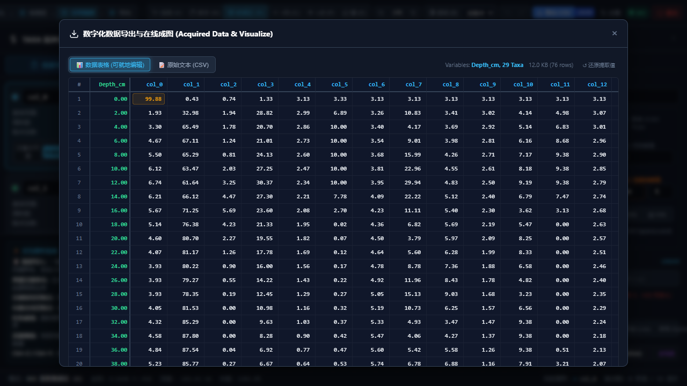

# Straditize Pro (v2.0)

<p align="center">
  <strong>下一代专业地层花粉与古气候图表数字化解译系统</strong><br>
  <em>Next-Generation Geological & Palynological Stratigraphic Diagram Digitization System</em>
</p>

<p align="center">
  
  
  
  
  
  
</p>

---

## 📖 项目简介 (Overview)

**Straditize Pro** 是针对地质剖面图、沉积物花粉图谱、地球化学指标以及年代-深度序列图表专门重构的数字化科研软件。

传统地层图谱数字化工具常受制于沉重的桌面图形包（如 PyQt / Matplotlib），存在图谱放大模糊、大图平移卡顿、刻度标定与古生态常用尺度脱节、各属种行数不均导致输出大量 `NA` 等痛点。

**Straditize Pro v2.0** 彻底重构了底层架构：
- **纯 Python 内核 (`straditize_core`)**：剥离所有桌面 GUI 与 Matplotlib 依赖，沉淀为基于 NumPy、SciPy 与 scikit-image 的高性能算力引擎，通过标准 JSON-RPC 2.0 协议向外提供服务；
- **现代 Web 前端 (`frontend`)**：采用 TypeScript 与原生 HTML5 Canvas 2D 视口，提供 120 FPS 平滑漫游、视网膜 DPR 自适应、高对比度色盲友好配色与对齐 WebPlotDigitizer (WPD) 的科学导出能力；
- **在线体验与教程**：支持通过 GitHub Pages 直接免安装在线体验交互 Demo 与操作教程。

---

## 🖥️ 软件界面与实测截图 (Preview)



> 上图为 Straditize Pro 在真实浏览器中解译经典地层图谱 *Hoya del Castillo* 并导出科学矩阵与 `riojaPlot` 脚本的实测截图。

---

## ⚡ 核心特性 (Key Features)

### 1. 统一坐标真相源 (Single Source of Truth)
- **两点式物理刻度钉标定**：放弃生硬的 0-100% 相对假定。端点 1 为物理基准线像素与起始值（允许非 0 起始，如对数底数或绝对深度），端点 2 为用户所见的物理刻度齿（如 20%、50% 等）；
- **线性 (Linear) 与对数 (Log) 双向精准换算**：
  $$\text{Linear: } \text{val}(x) = \text{startVal} + \frac{x - \text{startX}}{\text{tickEndX} - \text{startX}} \times (\text{tickVal} - \text{startVal})$$
  $$\text{Log: } \text{val}(x) = \exp\left(\ln(\text{startVal}) + \frac{x - \text{startX}}{\text{tickEndX} - \text{startX}} \times (\ln(\text{tickVal}) - \ln(\text{startVal}))\right)$$
- **对数前置硬约束拦截**：严格断言 $\text{startVal} > 0$ 且 $\text{tickVal} > 0$ 且 $\text{startVal} \ne \text{tickVal}$，界面即时禁用并醒目提示，杜绝任何静默错误或数学计算崩塌。

### 2. 严谨的地学层位求交与无 NA 输出
- **等深层位横向贯穿**：以地层连续剖面的所有深度层位对多属种轮廓线进行几何求交计算；
- **零丰度真值原则**：未出现属种或低于检出限层位在输出矩阵中**严格填入 `0.0`**（绝不输出可能破坏生态统计软件的伪 `NA`）；
- **首列无条件命名为 `depth`**，开箱直连 `rioja`、`vegan`、`Tilia` 及 `CONISS` 等分析管线。

### 3. S0 ~ S7 七阶段严格线性工作流状态机
- 彻底告别打开图片后后台胡乱盲跑切列引发错位的历史缺陷；
- 遵循 **S0 空状态 $\to$ S1 载入 $\to$ S2 ROI $\to$ S3 分列 $\to$ S4 标尺 $\to$ S5 拐点精修 $\to$ S6 校验 $\to$ S7 导出** 7 阶段状态机，胶囊打勾高亮，已完成阶段可自由跳回；
- **绿色原位半透明重叠层 (Visual Ghosting)**：数字化结果以半透明绿多边形原位叠加在底图黑白墨迹上方，肉眼秒级核对吻合度；
- **Radon 变换微斜角检测与矫正**：400ms 内求出图像扫描微小倾斜角并提供一键水平矫正；
- **全景 Minimap 缩略雷达导航**：右下角常驻 160×120px 缩略雷达，当前视口白框高亮，支持点击拖拽平滑漫游；
- **左右抽屉防丢拉环**：侧边栏与属性检查器折叠后，边缘常驻实体把手 `[› 属种清单]` 与 `[‹ 属性检查器]`，配合快捷键 `[` / `]` 双重保障；
- **100% 丰度总和自检门禁**：导出前自动计算各层位加和，偏离 100% 醒目警示，支持在双向冻结（表头与 Depth 列固定）表格中就地在线改数。

### 4. 研发发表级成果导出 (WPD-Aligned Exporter)
- **科学数据矩阵**：支持排序（深度升序/降序）、浮点精度格式化、一键复制到剪贴板与 CSV / Parquet 下载；
- **直通 `rioja::strat.plot`**：一键生成开箱即用的 R 语言地层出图脚本，完美复刻出版级花粉图谱；
- **开放标准工程归档 (`.tar`)**：依据 POSIX UStar 标准打包，包含 `manifest.json`、`image/original.png`、`straditize.json`、`data.csv`、`plot_strat.R` 及 `README.txt`，支持工程 100% 原样还原。

### 5. 单二进制与双启动模式 (Dual Launch Modes)
- **一个二进制产物 `straditize.exe`**，自动根据参数切换运行形态；
- **完全去除繁琐的 Token、密码与 Cookie 认证层**，远程访问安全边界全权委托给 SSH 端口转发。

---

## 🚀 快速上手 (Quickstart)

### 环境要求
- **Python**: `>= 3.12`
- **Node.js**: `>= 20` (仅开发或二次编译前端需要)
- **包管理器**: 推荐使用 [Pixi](https://pixi.sh) (一键配置 C/C++ 与 Python 依赖)

### 1. 源码克隆与环境就绪
```bash
git clone https://github.com/chmzs/straditize-pro.git
cd straditize-pro

# 安装并同步项目环境 (自动包含 NumPy, SciPy, scikit-image 等依赖)
pixi run install
```

### 2. 启动方式

#### 方式 A：桌面模式 (Desktop Mode - 本地研究与交互)
- **启动命令**：
  ```bash
  pixi run desktop
  ```
  *(Windows 用户也可直接双击根目录下的 `start_straditize.bat`)*
- **运行特征**：
  - Windows 环境首行自动隐藏控制台黑框；
  - 自动从 `8765` 起寻找未被占用的空闲端口；
  - 自动创建单实例锁（多次启动直接激活浏览器已有页面，不重复起进程）；
  - 自动调起系统默认浏览器访问；
  - **退出方式**：网页右上角常驻红色的 **`[⏻ 退出]`** 按钮，点击触发 `POST /shutdown`（服务端延迟 500ms 优雅释放锁并退出进程）。

#### 方式 B：服务器模式 (Server Mode - 远程计算与无头服务器)
- **启动命令**：
  ```bash
  pixi run rpc-server
  # 或自定义端口：
  python -m straditize serve --port 8765
  ```
  *(Windows 用户也可直接双击根目录下的 `start_straditize_server.bat`)*
- **运行特征**：
  - 严格只监听本机环回地址 `127.0.0.1:8765`；
  - **端口被占保护**：若指定端口被占用，直接向终端报错并退出，绝不静默 +1；
  - 终端前台流式输出访问日志；
  - **退出方式**：终端按下 `Ctrl+C` 终止；**网页界面严格隐藏退出按钮**（且 `/shutdown` 端点返回 403 Forbidden），防止协作人员误关后台。

---

## 🔒 远程访问：SSH 隧道安全边界四步法

Straditize Pro 遵循现代运维最佳实践，放弃易失效且容易产生安全漏洞的网页 Token / 密码机制，将网络边界交给工业标准的 SSH 隧道：

```bash
# 步骤 1: 在远程计算节点/服务器启动服务 (前台或放入 tmux/screen)
straditize serve
# 控制台输出：服务已启动：http://127.0.0.1:8765

# 步骤 2: 在你本地的笔记本/工作站打开终端，建立 SSH 本地端口转发
ssh -L 8765:127.0.0.1:8765 username@your-server-ip

# 步骤 3: 打开你本地电脑的浏览器，无密码、无 Cookie、免配置直连访问：
http://127.0.0.1:8765

# 步骤 4: 实验完毕后，在远程终端按 Ctrl+C 安全退出服务
```

---

## 📂 项目结构规范 (Directory Structure)

```text
straditize-pro/
├── .github/
│   └── workflows/                # GitHub Actions CI 与 Pages 自动化工作流
├── docs/                         # 官方文档与 GitHub Pages 在线展示站点
│   ├── index.html                # GitHub Pages 官网主页与教程入口
│   ├── JSON_RPC_SPECIFICATION.md # 核心 JSON-RPC 2.0 通信协议规范
│   └── tutorials/                # 图文科研实战教程
├── frontend/                     # 现代 Web 前端 (Vite + TypeScript)
│   ├── src/
│   │   ├── components/           # Canvas 画布、工具栏、侧边栏、属性检查器、导出模态框
│   │   ├── core/                 # 坐标真相源、历史管理、样条插值器、POSIX Tar 归档器
│   │   ├── services/             # JSON-RPC 客户端与同源自适应探测
│   │   └── types/                # 前端地学数据模型接口
│   └── dist/                     # 预编译好的纯静态 SPA 生产产物
├── straditize/                   # Python 核心与算法层
│   ├── straditize_core/          # 纯无 GUI 现代化算力内核
│   │   ├── calibration.py        # LinearCalibration 与 LogCalibration 核心类
│   │   ├── curve.py              # 显著度拐点提取与 RDP 轮廓压缩
│   │   ├── columns.py            # 分列线与基准纵线探测
│   │   ├── image.py              # 图像去网格、二值化、色彩掩膜
│   │   ├── rpc_server.py         # HTTP / Stdio 双协议服务与静态资源托管
│   │   └── session.py            # 会话状态机、数据求交与 POSIX UStar 导出
│   └── support/                  # PyInstaller 独立打包配方与产物
├── tests/                        # 真实浏览器与端到端自动化测试
│   ├── verify_browser_playwright_e2e.py # Playwright 真实 MS Edge 浏览器 E2E 交互测试
│   ├── verify_straditize_pro_e2e.py     # 科学求交与坐标真相源端到端测试
│   └── test_benchmark_morphologies.py   # 6 大图表形态基准测试
├── pixi.toml                     # 项目环境、任务与依赖声明
├── start_straditize.bat          # Windows 桌面模式双击启动器
├── start_straditize_server.bat   # Windows 服务器模式双击启动器
├── HANDOFF.md                    # 跨会话开发与交接记录 (符合开发规范)
└── README.md                     # 本文档
```

---

## 🧪 测试与质量验证 (Testing & Verification)

项目内置了从底层数学到真实浏览器的三层金字塔自动化测试验证体系：

```bash
# 1. 运行核心算法与标定单元测试
pixi run python -m pytest straditize/tests/test_core.py

# 2. 运行 JSON-RPC 2.0 协议全量测试
pixi run python -m pytest straditize/tests/test_rpc.py

# 3. 运行端到端科学计算与导出集成测试
pixi run python tests/verify_straditize_pro_e2e.py

# 4. 运行基于真实 MS Edge 浏览器的 Playwright 交互测试
pixi run python tests/verify_browser_playwright_e2e.py

# 5. 代码质量检查 (Ruff Linter)
pixi run lint
```

---

## 📄 许可证与引用 (License & Citation)

本项目遵循 **GNU General Public License v3.0 (GPL-3.0)** 开源。

如在古生态学、地质学、第四纪环境演变或古气候重建研究中使用了 Straditize Pro，欢迎引用本项目或原始文献：
- **Straditize Pro v2.0**: [https://github.com/chmzs/straditize-pro](https://github.com/chmzs/straditize-pro)
- **原始文献**: Sommer, P. S. (2019). *Straditize: A Python package for digitizing pollen diagrams*. Journal of Open Source Software.
