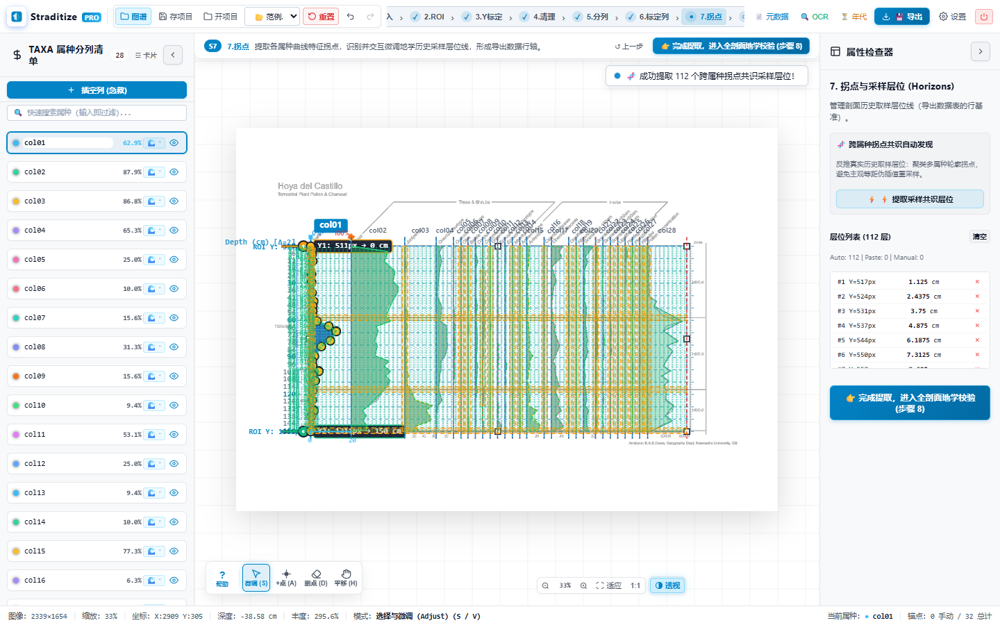

# Straditize Pro (v2.0)

<p align="center">
  
</p>

<p align="center">
  <strong>下一代专业地层花粉与古气候图表数字化解译系统</strong><br>
  <em>Next-Generation Geological & Palynological Stratigraphic Diagram Digitization System</em>
</p>

<p align="center">
  
  
  
  
  
  
</p>

---

> **文档导航**：本文面向使用者；开发者另有
> [`docs/ARCHITECTURE.md`](docs/ARCHITECTURE.md)（架构与设计规范 · 活文档）与
> [`AGENTS.md`](AGENTS.md)（开发操作手册）；跨会话开发断点见 `HANDOFF.md`。

## 📖 项目简介 (Overview)

**Straditize Pro** 是针对地质剖面图、沉积物花粉图谱、地球化学指标以及年代-深度序列图表专门重构的数字化科研软件。

传统地层图谱数字化工具常受制于沉重的桌面图形包（如 PyQt / Matplotlib），存在图谱放大模糊、大图平移卡顿、刻度标定与古生态常用尺度脱节、各属种行数不均导致输出大量 `NA` 等痛点。

**Straditize Pro v2.0** 彻底重构了底层架构：
- **纯 Python 内核 (`straditize_core`)**：剥离所有桌面 GUI 与 Matplotlib 依赖，沉淀为基于 NumPy、SciPy 与 scikit-image 的高性能算力引擎，通过标准 JSON-RPC 2.0 协议向外提供服务；
- **现代 Web 前端 (`frontend`)**：采用 TypeScript 与原生 HTML5 Canvas 2D 视口，提供 120 FPS 平滑漫游、视网膜 DPR 自适应、高对比度色盲友好配色与对齐 WebPlotDigitizer (WPD) 的科学导出能力；
- **在线文档与教程**：GitHub Pages 提供官方文档与图文实战教程。
  ⚠️ 原「免安装在线体验 Demo」已**下架**：该产物是一份早期构建快照，其内部保留了已被删除的示例数据通路，
  会向访问者展示并非由真实算法产出的结果。在线演示将改为「预置真实工程 + 只读浏览」的形式后再重新上线。

### 数据可信度：不存在替代数据通路

面向用户的数据**只有唯一合法来源：后端对用户输入的真实计算**。取不到就报错并停在原地。

这不是口号，而是被测试守卫的架构不变量（`tests/integration/test_no_fabrication.py`）：
历史上曾有"算法失败时用等分切割冒充识别结果 / 用随机抖动冒充提取曲线 / 用固定名单冒充 OCR 识别 /
用前端自算 CSV 冒充导出"等通路，现已全部**物理删除**而非仅加开关关闭。
详见 `docs/ARCHITECTURE.md` §2。

---

## 🖥️ 软件界面与实测截图 (Preview)



> 上图为 Straditize Pro 在真实浏览器中解译经典地层图谱 *Hoya del Castillo* 并导出科学矩阵与 `riojaPlot` 脚本的实测截图。

---

## ⚡ 核心特性 (Key Features)

### 1. 统一坐标真相源 (Single Source of Truth)
- **两点式物理刻度钉标定**：放弃生硬的 0-100% 相对假定。端点 1 为物理基准线像素与起始值（允许非 0 起始，如对数底数或绝对深度），端点 2 为用户所见的物理刻度齿（如 20%、50% 等）；
- **线性 (Linear) 与对数 (Log) 双向精准换算**：
  $$\text{Linear: } \text{val}(x) = \text{startVal} + \frac{x - \text{startX}}{\text{tickEndX} - \text{startX}} \times (\text{tickVal} - \text{startVal})$$
  $$\text{Log: } \text{val}(x) = \exp\left(\ln(\text{startVal}) + \frac{x - \text{startX}}{\text{tickEndX} - \text{startX}} \times (\ln(\text{tickVal}) - \ln(\text{startVal}))\right)$$
- **对数前置硬约束拦截**：严格断言 $\text{startVal} > 0$ 且 $\text{tickVal} > 0$ 且 $\text{startVal} \ne \text{tickVal}$，界面即时禁用并醒目提示，杜绝任何静默错误或数学计算崩塌。

### 2. 严谨的地学层位求交与无 NA 输出
- **等深层位横向贯穿**：以地层连续剖面的所有深度层位对多属种轮廓线进行几何求交计算；
- **零丰度真值原则**：未出现属种或低于检出限层位在输出矩阵中**严格填入 `0.0`**（绝不输出可能破坏生态统计软件的伪 `NA`）；
- **首列无条件命名为 `depth`**，开箱直连 `rioja`、`vegan`、`Tilia` 及 `CONISS` 等分析管线。

### 3. S0 ~ S7 七阶段严格线性工作流状态机
- 彻底告别打开图片后后台胡乱盲跑切列引发错位的历史缺陷；
- 遵循 **S0 空状态 $\to$ S1 载入 $\to$ S2 ROI $\to$ S3 分列 $\to$ S4 标尺 $\to$ S5 拐点精修 $\to$ S6 校验 $\to$ S7 导出** 7 阶段状态机，胶囊打勾高亮，已完成阶段可自由跳回；
- **绿色原位半透明重叠层 (Visual Ghosting)**：数字化结果以半透明绿多边形原位叠加在底图黑白墨迹上方，肉眼秒级核对吻合度；
- **Radon 变换微斜角检测与矫正**：400ms 内求出图像扫描微小倾斜角并提供一键水平矫正；
- **全景 Minimap 缩略雷达导航**：右下角常驻 160×120px 缩略雷达，当前视口白框高亮，支持点击拖拽平滑漫游；
- **左右抽屉防丢拉环**：侧边栏与属性检查器折叠后，边缘常驻实体把手 `[› 属种清单]` 与 `[‹ 属性检查器]`，配合快捷键 `Ctrl+[` / `Ctrl+]` 双重保障；
- **100% 丰度总和自检门禁**：导出前自动计算各层位加和，偏离 100% 醒目警示，支持在双向冻结（表头与 Depth 列固定）表格中就地在线改数。

### 4. 研发发表级成果导出 (WPD-Aligned Exporter)
- **科学数据矩阵**：支持排序（深度升序/降序）、浮点精度格式化、一键复制到剪贴板与 CSV / Parquet 下载；
- **直通 `rioja::strat.plot`**：一键生成开箱即用的 R 语言地层出图脚本，完美复刻出版级花粉图谱；
- **开放标准工程归档 (`.tar`)**：依据 POSIX UStar 标准打包，包含 `manifest.json`、`image/original.png`、`straditize.json`、`data.csv`、`plot_strat.R` 及 `README.txt`，支持工程 100% 原样还原。

### 5. 单二进制与双启动模式 (Dual Launch Modes)
- **一个二进制产物 `straditize.exe`**，自动根据参数切换运行形态；
- **完全去除繁琐的 Token、密码与 Cookie 认证层**，远程访问安全边界全权委托给 SSH 端口转发。

---

## 🚀 快速上手 (Quickstart)

### 环境要求
- **Python**: `>= 3.12`
- **Node.js**: `>= 20`（**运行必需**：前端产物 `frontend/dist` 不入库，需本地构建后由后端托管）
- **包管理器**: 推荐使用 [Pixi](https://pixi.sh) (一键配置 C/C++ 与 Python 依赖)

### 1. 源码克隆与环境就绪
```bash
git clone https://github.com/chmzs/straditize-pro.git
cd straditize-pro

# 1.1 安装 Python 后端与科学计算依赖 (NumPy / SciPy / scikit-image 等)
pixi run install

# 1.2 构建前端界面产物 → frontend/dist
#     该目录不入库，跳过这步后端将托管不到任何界面
npm --prefix frontend install
npm --prefix frontend run build
```

### 2. 启动方式

#### 方式 A：标准应用模式 (App Mode - 本地研究与交互推荐)
- **启动命令**：
  ```bash
  pixi run app
  ```
  *(Windows 用户也可直接双击根目录下的 `start_straditize.bat`)*
- **运行特征**：
  - 自动从 `8765` 起寻找未被占用的空闲端口；
  - 自动创建单实例锁（多次启动直接激活浏览器已有页面，不重复起进程）；
  - 自动调起系统默认浏览器访问；
  - **退出方式**：网页右上角常驻红色的 **`[⏻ 退出]`** 按钮，点击触发 `POST /shutdown`（服务端延迟 500ms 优雅释放锁并退出进程）。

#### 方式 B：服务器模式 (Server Mode - 远程计算与无头服务器)
- **启动命令**：
  ```bash
  python -m straditize_core.rpc_server serve --port 8765
  ```
- **运行特征**：
  - 默认监听本机环回地址 `127.0.0.1:8765`（或在设置开启远程访问后监听局域网/Tailscale）；
  - **端口被占保护**：若指定端口被占用，直接向终端报错并退出，绝不静默 +1；
  - 终端前台流式输出访问日志；
  - **退出方式**：终端按下 `Ctrl+C` 终止；**网页界面严格隐藏退出按钮**（且 `/shutdown` 端点返回 403 Forbidden），防止协作人员误关后台。

#### 方式 C：前端开发模式 (Frontend Dev - 仅修改前端时使用)
- **启动命令**：
  ```bash
  pixi run app            # 终端 1：后端
  pixi run frontend-dev   # 终端 2：Vite 开发服务器 → http://localhost:5173
  ```
- 浏览器访问 `http://localhost:5173`。Vite 已把后端路由前缀代理到 8765，
  因此**浏览器端始终是同源**，无需为开发模式开放任何跨源例外。

> ⚠️ **不要用 `pixi run run-straditize`**（即 `python -m straditize`）：它启动的是上游第三方 PyQt5 原版，
> **不是本项目的现代版**，且当前环境缺少 `docrep` 等依赖会直接报错，命令名具有误导性。
> 该子树目前仅因提供内置范例所需的示例图片而保留。

---

## 🔒 远程访问：SSH 隧道安全边界四步法

Straditize Pro 遵循现代运维最佳实践，放弃易失效且容易产生安全漏洞的网页 Token / 密码机制，将网络边界交给工业标准的 SSH 隧道：

```bash
# 步骤 1: 在远程计算节点/服务器启动服务 (前台或放入 tmux/screen)
pixi run rpc-server
# 控制台输出：服务已启动：http://127.0.0.1:8765

# 步骤 2: 在你本地的笔记本/工作站打开终端，建立 SSH 本地端口转发
ssh -L 8765:127.0.0.1:8765 username@your-server-ip

# 步骤 3: 打开你本地电脑的浏览器，无密码、无 Cookie、免配置直连访问：
http://127.0.0.1:8765

# 步骤 4: 实验完毕后，在远程终端按 Ctrl+C 安全退出服务
```

### 为什么不需要 Token / 密码

网络边界完全由 SSH 承担（后端只监听回环），同时后端自身还有两道校验
（`straditize_core/rpc_server.py`）：

| 校验 | 目的 |
| --- | --- |
| `Host` 必须是回环（或显式绑定的主机） | 阻断 **DNS rebinding**——攻击者域名解析到 127.0.0.1 时 Origin 与 Host 会同时是攻击者域名，仅比对二者会被绕过 |
| `Origin` 若存在，必须与请求自身 Host 同源 | 阻断 **CSRF**；浏览器对同源 POST 也会发送 Origin，故同源必须放行 |

并且**绝不回显 `Access-Control-Allow-Origin: *`**。历史上该头使**用户浏览的任意网页都能读写本机后端**
（CORS 允许读取响应），既可窃取已载入的图谱与数字化数据，也可篡改会话——该漏洞已于 2026-09-20 修复。

> 请勿为了"方便"把它改回通配符。开发模式所需的跨源已由 Vite 代理消除
> （见方式 C；代理的 `changeOrigin` 必须保持 `false`，否则同源校验会正确地拒绝请求）。

---

## 📂 项目结构规范 (Directory Structure)

```text
straditize-pro/
├── .github/
│   └── workflows/                # GitHub Actions CI 与 Pages 自动化工作流
├── docs/                         # 官方文档与 GitHub Pages 站点
│   ├── ARCHITECTURE.md           # 架构与设计规范 (活文档：不变量 / 交互规范 / 数据流)
│   ├── JSON_RPC_SPECIFICATION.md # 核心 JSON-RPC 2.0 通信协议规范
│   ├── TASK_SPEC_V2_FINAL.md     # 早期需求任务书 (历史件，不再更新)
│   ├── index.html                # GitHub Pages 官网主页与教程入口
│   └── tutorials/                # 图文科研实战教程
├── frontend/                     # 现代 Web 前端 (Vite + TypeScript)
│   ├── src/
│   │   ├── components/           # Canvas 画布、工具栏、侧边栏、属性检查器、导出模态框
│   │   ├── core/                 # 坐标真相源、历史管理、样条插值器、POSIX Tar 归档器
│   │   ├── services/             # JSON-RPC 客户端与同源自适应探测
│   │   └── types/                # 前端地学数据模型接口
│   └── dist/                     # 前端构建产物 (不入库；由 npm run build 生成，后端据此托管界面)
├── straditize_core/              # 现代版纯无 GUI 算力内核 (本项目维护)
│   ├── calibration.py            # LinearCalibration 与 LogCalibration 核心类
│   ├── curve.py                  # 显著度拐点提取与 RDP 轮廓压缩
│   ├── columns.py                # 分列线与基准纵线探测
│   ├── image.py                  # 图像去网格、二值化、色彩掩膜
│   ├── age_depth.py              # 年代-深度模型识别、提取与不确定性映射
│   ├── ocr/                      # OCR 识别与科属中拉丁词典
│   ├── rpc_server.py             # HTTP / Stdio 双协议服务、访问控制与静态资源托管
│   └── session.py                # 会话状态机、数据求交与 POSIX UStar 导出
├── support/                      # 现代版打包配方 (PyInstaller spec) 与数据同步脚本
├── straditize/                   # 上游第三方 PyQt5 原版 (不维护；仅提供范例示例图片)
├── tests/                        # pytest 测试：按层级分 unit / integration
│   ├── conftest.py               # 仓库根 sys.path 注入 + 装载隔离区
│   ├── quarantine.txt            # 已知失败用例隔离区（strict xfail，只减不增）
│   ├── unit/                     # 24 个文件：直接调 straditize_core API
│   ├── integration/              # 6 个文件：经 JSON-RPC dispatcher / HTTP 传输
│   └── data/                     # 测试夹具：figures / truth / corpus
├── frontend/e2e/                 # 真实浏览器 E2E（@playwright/test + 系统 MS Edge）
├── scripts/                      # 手工验收、基准与下载脚本（不被 pytest 收集）
├── pixi.toml                     # 项目环境、任务与依赖声明
├── start_straditize.bat          # Windows 桌面模式双击启动器
├── start_straditize_server.bat   # Windows 服务器模式双击启动器
├── HANDOFF.md                    # 跨会话开发与交接记录 (符合开发规范)
└── README.md                     # 本文档
```

---

## 🧪 测试与质量验证 (Testing & Verification)

三层验证体系：**数学内核单元测试 → 端到端集成测试 → 真实浏览器交互测试**。
以下命令与 CI（`.github/workflows/ci.yml`）一致，可在仓库根目录直接执行：

```bash
# 1. 后端全量测试 (核心算法 / JSON-RPC / 端到端 / 年龄模型 / OCR / 组件管理等)
pixi run test

# 2. 代码质量检查 (Ruff + 8 项跨文件一致性核对)
pixi run lint

# 3. 前端类型检查与构建 (tsc + vite)
npm --prefix frontend run build

# 4. 前端核心功能自检 (Node)
npm --prefix frontend test

# 5. 真实浏览器 E2E（@playwright/test，驱动系统已装 MS Edge）
pixi run test-e2e
npm --prefix frontend run test:e2e:typecheck   # e2e 代码的类型检查

# 6. 只跑契约 lane（改 RPC 契约时的快速反馈：实测 26s，全量约 110s）
pixi run test-contract
```

> 现代版测试位于仓库根 `tests/`，而非上游遗留的 `straditize/tests/`
> （后者只属于那条 PyQt5 分支，当前环境缺依赖跑不起来）。
> 其中 `tests/integration/test_no_fabrication.py` 专门守卫"不得返回替代数据"这条不变量。
>
> 浏览器 E2E 在 `frontend/e2e/`：`playwright.config.ts` 的 `webServer` 会自动拉起
> 一个隔离后端（`support/serve_e2e_backend.py`，默认端口 8799），每条用例前经
> `e2e.reset` 复位到 hoya 基线，因此不依赖、也不干扰你手工打开的 8765 实例。
> 需要本机已装 Edge 与 Node ≥ 20；不需要 `playwright install`。
>
> 分层职责、各层的取舍与"明确不做的事"见 **`docs/testing-strategy.md`**；
> 新增测试该放哪一层也查那张表。

---

## 📄 许可证与引用 (License & Citation)

本项目遵循 **GNU General Public License v3.0 or later (GPL-3.0-or-later)** 开源。

如在古生态学、地质学、第四纪环境演变或古气候重建研究中使用了 Straditize Pro，欢迎引用本项目或原始文献：
- **Straditize Pro v2.0**: [https://github.com/chmzs/straditize-pro](https://github.com/chmzs/straditize-pro)
- **原始文献**: Sommer, P. S. (2019). *Straditize: A Python package for digitizing pollen diagrams*. Journal of Open Source Software.
