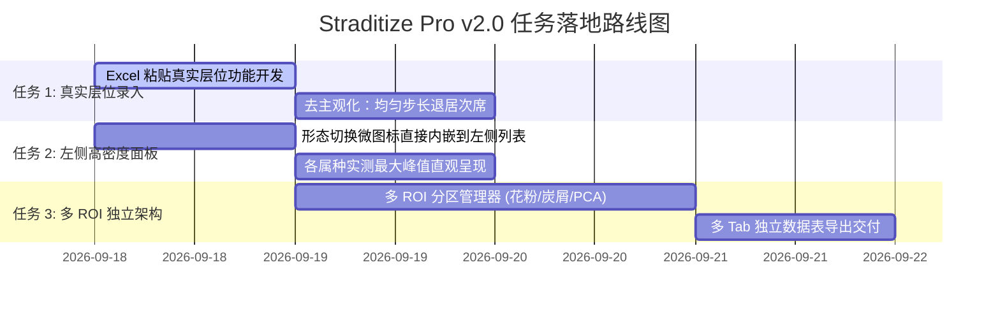

# Straditize Pro v2.0 科学数字化系统——核心需求、架构定位与重构任务书

**编制人**：agent02 (`agent02@dsh.local`)  
**状态基线**：已通过全量 48 项单元与端到端测试，现针对用户深度实操反馈进行最终架构对齐与产品任务定稿。  
**核心宗旨**：**恪守科学软件伦理红线，忠实还原原图物理真实，拒绝越俎代庖的伪插值，构建极致纯粹的高保真人机协作界面。**

---

## 第一部分：需求与哲学定位梳理（哲学与原则）

### 1. 科学软件的伦理红线（核心认知重塑）
- **绝不替下游做科学假设**：原始地质图谱当年的采样时间/深度是非等距、非均匀的（如 12.5cm, 14.0cm, 18.2cm...）。系统**严禁默认强加“每 2cm 人工均匀插值”**，严禁在数字化阶段主观制造“伪数据 (Artifacts)”。
- **忠实于原始物理真实**：数字化的唯一天职是**“尽可能提取出代表原数据的情况”**。下游模型需要重采样、低通滤波、小波分析或排序建模，属于 R 语言等下游工具的职责范围。

### 2. 真实科研场景的 4 大核心痛点与对策
1. **拿不到原始钻孔层位表**：通过“图谱印刷采样刻痕逆向捕获”与“全属种真实物理拐点并集”提取原始层位；
2. **持有原始钻孔深度表**：支持直接从 Excel 一键复制粘贴真实的非均匀深度序列（`Ctrl+C` $\to$ `Ctrl+V`），直接以真实层位横切求交；
3. **混合多指标共存（花粉/炭屑/第一主成分/统计量）**：通过“多 ROI 分区架构”将不同物理量纲、不同形态的图表拆分到独立 ROI，导出各自独立的数据表；
4. **数十列形态繁杂**：通过“墨迹特征智能初判 + 左侧列表一键纠正”，绝不让用户每个属种手动选择。

---

## 第二部分：架构与 UI/UX 规范对齐（已达成共识）

| 模块 | 规范要求 | 落地状态 |
| :--- | :--- | :--- |
| **工作流心智** | 严格 7 阶段状态机（S0 空状态 $\to$ S1 载入 $\to$ S2 ROI $\to$ S3 分列 $\to$ S4 标尺 $\to$ S5 拐点 $\to$ S6 校验 $\to$ S7 导出） | 已闭环，胶囊高亮打勾，可点击跳回 |
| **ROI 纯净度** | S1/S2 阶段画布绝对纯净，严禁提前显示分列虚线与刻度齿 | 已彻底根除，S1/S2 只呈现纯净底图与 8 手柄 ROI |
| **左右抽屉** | 顶栏无冗余按钮；面板内部 `<` / `>` 收起；折叠后左右边缘常驻**极浅冷灰悬浮拉手**；`localStorage` 状态持久化；支持 `Ctrl+B` 与 `Ctrl+Shift+I` | 已落地并验证对称性 |
| **贝塞尔平滑** | 尚未投产，无需向下兼容负担，彻底从代码和 UI 中物理剔除，唯一采用严格折线连接 | 已从模型、插值器和界面彻底删除 |
| **日间模式** | 告别大块脏灰，侧边栏极浅冷灰 `#F8F9FA`，画布纯白 `#FFFFFF`，细边框 `#E5E7EB`，输入框边框锐化 | 已完成高对比科研实验室白底适配 |
| **底部工具条** | 帮助项 `[ ? 帮助 ]` 整合至浮动工具条最左端，尺寸 40×40 严格水平严丝合缝对齐 | 已完成整合 |
| **两点式数轴** | 浅色模式下采用白底细边框与双色高对比，彻底消灭黑块补丁 | 已完成组件化抽离并适配 |
| **字体渲染** | 系统现代字体栈（-apple-system / Segoe UI / PingFang SC），开启亚像素抗锯齿与对比度增强 | 已完成构建并实测验证 |

---

## 第三部分：待执行工程任务清单（任务书 Action Items）

### 任务 1：从 Excel 一键粘贴真实样品层位序列 (Excel Depth Pasting)
- **目标**：解决“非均匀采样、无原始 CSV 文件”的输入痛点，告别另存文件的繁琐。
- **具体工作**：
  1. 在 S4（标尺标定）检查器中增加 **`[ 📋 从 Excel 粘贴真实样品深度序列 ]`** 弹窗；
  2. 支持直接捕获操作系统的制表符/换行符剪贴板文本，5 行核心代码完成清洗，自动剔除表头文字、自动排序去重；
  3. 界面即时回显解析结果（如：*已解析 76 个实际钻孔层位，跨度 12.5 ~ 145.0 cm*）；
  4. 应用后，画布上的水平参考线与后端求交截线自动绑定为这组**真实的、非均匀的物理深度**；
  5. 导出时的首要数据集形态默认为**“原始样品层位矩阵”**，将“等间距步长”降级为可选辅助项。

### 任务 2：左侧列表利用率提升与形态直观切换 (Left Panel Enhancement)
- **目标**：解决“形态切换在右侧导致鼠标频繁横跨全屏”的折磨，大幅提升左侧面板的信息密度。
- **具体工作**：
  1. **形态微图标直观切换**：在左侧每个属种行右侧放置微型形态图标：`[🌊]` (面积) / `[📊]` (柱状) / `[📈]` (折线) / `[➕]` (符号)；
     - 依据算法特征**自动初判预设**，学者发现个别误判时，直接在左侧点击图标就地 1 秒纠正；
  2. **直观呈现属种实测最大峰值**：每个属种行右侧除了显示点数外，直接显示该列最大丰度（如 `88.1%`、`73.9%`），一眼扫出主导优势种；
  3. **专注聚焦模式 (Focus Mode)**：顶部增加 `[全显 / 仅看当前]`，开启后其他列半透明暗化，彻底消除视觉过载。

### 任务 3：多 ROI 分区架构与多 Tab 独立导出 (Multi-ROI Architecture)
- **目标**：解决复杂图谱中“花粉区（百分比）、炭屑区（浓度/对数）、主成分（正负折线）、统计量（柱状）”混在一张图上的拆分难题。
- **具体工作**：
  1. 默认识别 1 个核心数据有效区（ROI 1），并允许学者拖拽手柄定稿；
  2. 左侧面板顶部提供 **`[➕ 加分区 (Add ROI)]`**，支持学者在画布上继续圈出 ROI 2（炭屑区）或 ROI 3（第一主成分）；
  3. 点击左侧对应的 ROI 卡片，画布自动高亮该区域并联动下方的列名单；
  4. S7 导出面板支持多 Tab 切换或一键分表打包下载（`pollen_percent.csv`、`charcoal_conc.csv`、`pca1.csv`），各区物理量纲完全独立，绝不相互污染。

---

## 第四部分：验收标准与交付清单

1. **测试基线**：全套 48 项单元与端到端测试 100% 保持通过；
2. **Ruff / TypeScript 检查**：0 errors, 0 warnings；
3. **Playwright 真实浏览器实操核验**：
   - 验证从 Excel 选中一列深度，粘贴到软件后层位网格精准重排；
   - 验证左侧面板直接点击微图标切换形态，右侧同步联动；
   - 验证多 ROI 分区创建、切换与导出分表功能。
