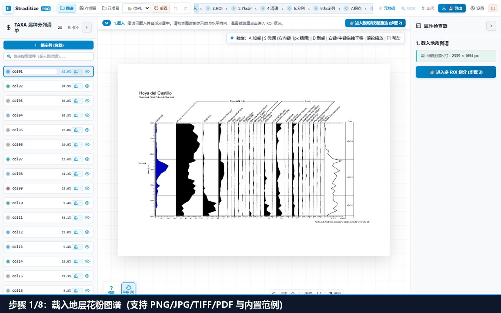

# 教程 1：五分钟快速上手古生态图谱数字化 (8 步全流程)

本教程指导你如何利用 **Straditize Pro v2.0** 的 **8 阶段地学图谱解译工作流**，将一张地层花粉、微炭屑与古气候图谱扫描件解译为发表级的高保真科研数据矩阵。

---

## 阶段概览：8 步科学解译工作流

顶部导航条提供 8 个状态胶囊，已完成标记为 `✓`，当前进行中为 `●`，未开始为 `○`：

```
[1.载入] → [2.取数区] → [3.Y标定] → [4.去线] → [5.分列与命名] → [6.X刻度与样式] → [7.数字化与层位] → [8.校验与导出]
   ✓          ✓          ✓         ✓           ✓              ✓               ✓               ●
```

你可以随时点击已完成的步骤胶囊跳回修改，也可以通过右侧步骤面板底部的推进按钮顺序流转。



---

## 步骤 1：载入图谱图片与大图安全保障

1. **载入方式**：
   - 点击顶栏 **[📁 图谱]** 按钮选择本地文件（支持 PNG / JPG / TIFF / WebP / 单页 PDF）；
   - 或者直接将图片拖拽至中央画布虚线框释放；
   - 快速体验：在顶栏 **“📂 范例...”** 下拉菜单中选择 **`Hoya`** 或 **`Beginner`** 剖面。
2. **大图与微斜安全防护**：
   - **尺寸预算**：主力覆盖 A4/A3 600 DPI（约 5000×7000 ~ 7000×10000 px）。超过 8000×12000 px 时系统自动弹出安全拦截窗口，可一键选择 50% 降采样加载，内存严格受控在 1 GB 以内；
   - **智能微斜检测 (Radon Deskew)**：载入后系统自动进行氡变换倾角检测。若检测到扫描存在 $\ge 0.3^\circ$ 的微斜，右上角自动滑出提示横幅，点击 **[旋转校正]** 即可 1 秒恢复水平。
3. **完成加载**：图片自适应居中，进入步骤 2。

---

## 步骤 2：管理取数区 (Multi-ROI)

1. 工具栏自动激活 **ROI 模式**（快捷键 `R`）；
2. 画布上呈现 8 个方块控制手柄：
   - 拖拽手柄对齐花粉数据区边界；
   - **地学规范**：**严格将左侧纵坐标轴线、右侧聚类分析树 (CONISS) 与底部刻度排除在框外**；
   - 边框标签只报**像素范围**（如 `ROI Y: 511px - 1311px`）——取数区不携带任何深度含义；
3. **多取数区 (Multi-ROI) 支持**：
   - 如果图谱包含主花粉丰度区、炭屑浓度区或磁化率附图，可在右侧面板点击 **[＋ 新建取数区]** 分块管理；
   - 每个取数区拥有独立的名称、分列集合与百分比组合属性（`composition=true/false`）；
4. 点击右侧面板 **[👉 确认取数区，进入 Y 轴标定]** 推进。

---

## 步骤 3：Y 轴两点标定（深度 / 年代轴）

> ⚠️ **科学不变量**：**Y 轴标定与取数区 (ROI) 完全解耦**。未标定时界面如实显示 `--`，系统绝不拿取数区边框冒充真实刻度。

1. **两点标定操作**：
   - 在图上找到 Y 轴两个已知刻度水平线（例如 `0 cm` 与 `150 cm` 所在行）；
   - 在面板填入两点的像素行与真实物理数值及单位（`cm` / `m` / `cal yr BP` 等）；
   - 支持向下递增（深度）与向上递增（年代）；
2. **标定参考可视化**：
   - 画布呈现黄色半透明标定跨度带与两条 ⚑ 刻度基准线，超出该跨度的层位自动作为外推区标记；
3. 点击右侧面板 **[👉 确认标定，进入去线清理]** 推进。

---

## 步骤 4：去线与网格降噪 (Cleanup)

1. 点击 **[🔍 自动扫描候选线]**，后端智能检测水平分带线与网格线；
2. **即时透视遮罩 (B 键)**：
   - 按下键盘 **`B`** 键，画布开启双色二值化透视遮罩：
   - ⚪ **白色**：保留下来的花粉轮廓与墨迹；
   - 🔴 **红色**：被识别并剔除的线像素（后端掩膜原样呈现，**所见即数字化所用**）；
3. **排除框与画笔微调**：
   - 复杂图表可添加 **排除区 (Exclusion Rect)** 保护图注或特征区域；
   - 使用修正画笔手工擦除误标或补标漏线，松手即刻触发后端增量重算；
4. 点击右侧面板 **[👉 确认清理，进入分列与命名]** 推进。

---

## 步骤 5：分列与属种命名 (Naming)

1. 系统在纯数据区内自动探测属种垂直基线（虚线显示）；
2. **属种名单对齐与批量导入**：
   - 行内点击列标题快速重命名；
   - 点击 **[📋 批量导入]**，直接粘贴来自文献表格的多行属种名单，自动从左到右匹配；
3. **离线 PP-OCRv6 属种识别**：
   - 点击顶栏 **[🔍 OCR 属种名识别]**；
   - 支持 0°/30°/45°/60° 旋转投影识别倾斜标签；
   - 内置花粉、硅藻、微体古生物 (NPP) 权威中拉科学词典，支持自动模糊拼写纠错；
   - 支持粘贴期刊图版说明（Plate caption）一键解析并保存自定义属种词条；
4. 点击右侧面板 **[👉 确认列，进入刻度标定]** 推进。

---

## 步骤 6：X 轴两点物理刻度标定与列组

1. **两点式物理标定 (Two-Point Tick Calibration)**：
   - **端点 1 ($P_1$)**：列基准原点，通常为 `0%`（对数尺度为起始正数）；
   - **端点 2 ($P_2$)**：印刷刻度齿，在图上填入真实读数（如 `20%`、`50%`、`100%`），拖拽画布橙色刻度手柄对齐；
2. **列组 (Column Groups) 统一管理**：
   - 同属一个刻度规范的属种列（如均为 0-20%）可归入同一列组，一次调参、全组自动应用；
3. **尺度与对数保护**：
   - 炭屑或浓度指标可切换对数尺度 (Log Scale)；
   - 若起点 $\le 0$，系统自动禁用 Log 选项并红字警示拦截，杜绝 $\ln(0)$ 产生异常；
4. 点击右侧面板 **[👉 确认刻度，开始数字化提取]** 推进。

---

## 步骤 7：数字化、曲线拐点与采样层位

1. 系统自动提取轮廓边缘并压缩为高显著性拓扑拐点；
2. **层位共识提取**：
   - 点击 **[🎯 自动提取共识层位]**，系统分析所有属种波峰与基线相交位置，自动生成地层采样层位矩阵；
   - 支持单行删除与层位深度微调；
3. **年代-深度模型提取 (Age-Depth Modal)**：
   - 点击顶栏 **[⏳ 年代模型]**，载入图谱附带的 Bacon 或 Bchron 年代图；
   - 自动追踪中位数年代曲线与 95% 置信包络区间；
   - 基于贝叶斯先验生成 1000 条单调年代学集合实现，与花粉层位无缝映射；
4. 点击右侧面板 **[👉 确认数据，进入校验与导出]** 推进。

---

## 步骤 8：地学 QA 诊断与发表级成果导出

1. **地学质量把关 (QA Diagnostics)**：
   - **百和检验 ($\sum\%$ 门禁)**：自动检验全剖面各层位百分比加和（默认容差 $\pm 2.0\%$），直观标出超限与空层位；
   - **未标定列显式警示**：若有属种列未标定刻度，明确提示 ⚠️ 状态，杜绝带病导出；
2. **FAIR / LiPD v1.3 标准元数据录入**：
   - 点击顶栏 **[📄 元数据]**，录入文献 DOI、站点经纬度、水深、孔长、采集人与基金信息；
   - 支持**外部 AI 免 Token 导入助手**：一键复制结构化 Prompt，粘贴外部网页 AI 解读结果即刻自动解析回填；
3. **多格式科研成果一键导出**：
   - **`[💾 下载 CSV]`**：标准无 NA 地层百分比矩阵；
   - **`[📊 导出多表 Excel]`**：每个取数区独立 Sheet，附带综合统计与元数据；
   - **`[🌐 导出 LiPD]`**：国际古气候数据共享标准格式（含测量表与年代集合）；
   - **`[📦 导出 TAR 包]`**：POSIX UStar 开放项目包，内嵌双原图、JSON 矢量模型与完整中间态，零依赖 100% 科学复现；
   - **`[📈 R 脚本]`**：生成开箱即用的 `plot_strat.R`，直通 `rioja::strat.plot()` 出版级绘图！
